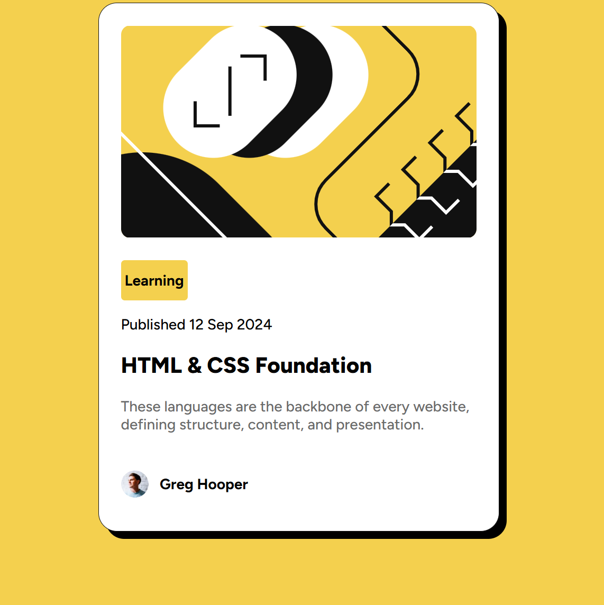

# Frontend Mentor - Blog Preview Card Challenge

This is a solution to the **Blog Preview Card Challenge** on [Frontend Mentor](https://www.frontendmentor.io/). Frontend Mentor challenges help you improve your front-end skills by building real projects using professional designs and assets.

##  Overview

###  The Challenge

Your users should be able to:

- View the optimal layout depending on their device's screen size
- See hover and focus states for interactive elements
- Use semantic HTML and maintain accessibility best practices

### Live Preview
You can view the live version of this project here: https://blog-card-frontenddev.netlify.app

###  Screenshot

###  Built With

- Semantic HTML5
- CSS3 (Flexbox and custom properties)
- Local font files (`Figtree`) via `@font-face`

##  Folder Structure

project-folder/ │
                ├── assets/ │
                            ├── fonts/ │ 
                                       │ └── Figtree-*.ttf 
                            │
                            └── images/ │ ├── illustration-article.svg │ └── image-avatar.webp
                │
                ├── index.html
                └── style.css

##  Getting Started

To view the project locally:

1. Clone the repo or download the files
2. Open `index.html` in your browser
3. Make sure all asset paths are correctly linked

##  What I Learned

- How to structure semantic HTML for card components
- How to use `@font-face` for custom fonts
- Improved understanding of layout using Flexbox
- Better spacing and alignment with `gap`, `padding`, and `margin`
- Styling accessible elements and maintaining visual hierarchy

##  Future Enhancements

- Make the card fully responsive for all screen sizes
- Add hover/focus effects for accessibility
- Include transitions for smoother UI experience

##  Acknowledgments

- Thanks to [Frontend Mentor](https://www.frontendmentor.io/) for the challenge and design.
- Font used: [Figtree](https://fonts.google.com/specimen/Figtree) (self-hosted from Google Fonts)

##  License

This project is intended for learning and personal use only.

